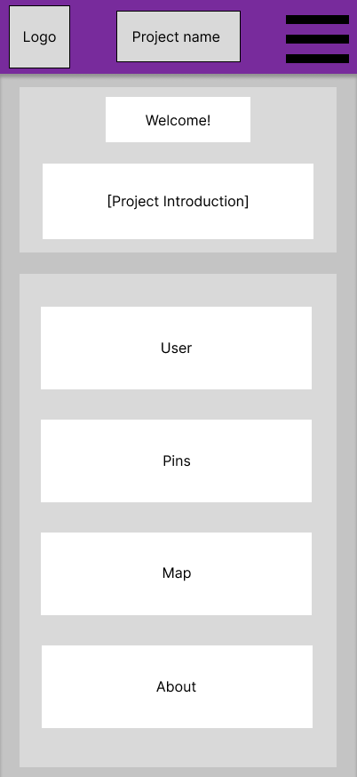
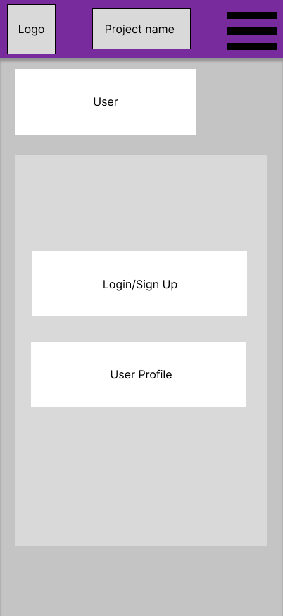
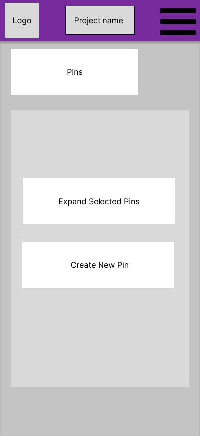
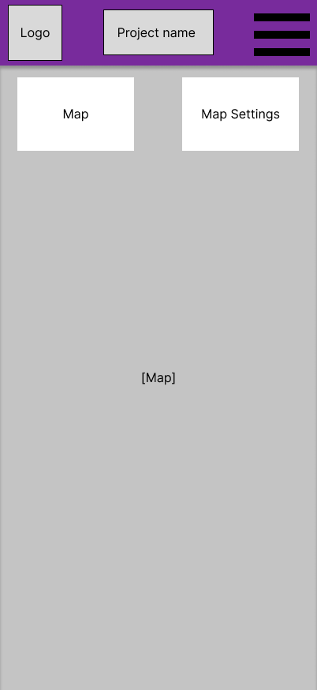

# User Experience Design

## Prototype

You can view and interact with the full prototype of While We Were Dreaming [here](https://www.figma.com/proto/I6RjRxM0OYAEB7d8XJelcX/While-We-Were-Dreaming?node-id=1-2&t=RvDExkdPPokDqlZd-1).

## App Map

The following diagram outlines the structure of our project. This app map displays the main sections of the app, which guide users through creating, exploring, and managing their memory pins on campus.

## Mobile Wire Frame PNGs

1. Home Page

   

2. User Page

    
    - login in/sign up
    - user profile

3. Pins Page

   
   - expand selected pin
   - create new pin
   - prompt
  
4. Map Page

    
    - map settings
    - personal pin view
  
5. About Page

   
   - feedback
   - contact
